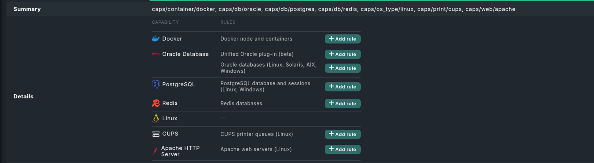

# caps-scout

A Checkmk agent plugin that discovers host capabilities and reports each one as a
Checkmk host label of the form `caps/<capability>`, so you can see at a glance which
Checkmk plugins are worth installing on that host. The goal is to eventually cover
most of what Checkmk's official plugins monitor. Coverage today includes databases,
web and application servers, containers and virtualization, clustering and HA,
backup and DR, messaging and monitoring engines, collaboration platforms, and cloud
VM provisioning. See [Detected capabilities](#detected-capabilities) below for the
full list.

**Prerequisites.** For the Capabilities Scout service to render correctly, set these
two things in Checkmk:

- **Escape HTML in service output:** add a rule under Setup → Services → Service
  monitoring rules → "Escape HTML in service output", set it to "Don't escape HTML",
  limit it to the `Capabilities Scout` service, and activate changes. Without it, the
  logos and "Add rule" links show up as raw HTML text.
- **Maximum long output size:** on hosts with many capabilities, raise Setup → Global
  settings → "Maximum long output size" above its default of 2000 bytes. Otherwise
  the service details are cut off.

See [Capabilities Scout service](#capabilities-scout-service) below for why each one
is needed.



## Why

Checkmk ships dedicated plugins for monitoring specific, already-configured
integrations (a database connection, a web server's status page, ...), but nothing
detects *which* of those engines are actually present on a host to suggest which
plugins to install.

caps-scout fills that gap: it looks for the engine itself — a running process, or,
where a process match isn't reliable, a file or directory only that engine would
create — and emits a host label for each one it finds, regardless of whether a
corresponding official Checkmk plugin is already installed and monitoring it — so
the capability is visible on the host either way.

## How it works

caps-scout runs as a Checkmk agent plugin and emits a standard
Checkmk `<<<labels:sep(0)>>>` section — a JSON object of label key/value pairs — to
enrich the monitored host's labels, with each label reflecting a detected
capability. Checkmk's core turns this section into host labels automatically.
caps-scout only emits a label when it finds something worth attention.

For SNMP devices — network gear, appliances, and other equipment with no Checkmk
agent to run the Rust binary on — capability detection instead happens Checkmk-side:
a Checkmk `agent_based` plugin fetches the two universal SNMPv2-MIB System-group
scalars (`sysDescr`, `sysObjectID`) over the host's already-configured SNMP
credentials and matches them against the same `detect=` conditions Checkmk's own SNMP
device plugins use, emitting a `caps/snmp/<family>` label for each one that
would apply. See [SNMP plugin-match labels](#snmp-plugin-match-labels) below.

The Rust agent plugin itself can be deployed two ways: manually, by copying the
compiled binary onto the host (see "Installing as a Checkmk agent plugin" below), or
via a Checkmk Agent Bakery rule that bakes the binary onto the agent package for every
host the rule covers — no manual copy step needed. See
[Bakery rule for the agent plugin](#bakery-rule-for-the-agent-plugin) below.

### Scope

Platforms built today: Linux and Windows (see Building, below).

Every label below is `"yes"`-valued and emitted only when the capability is found —
see "How it works" above. Labels are emitted regardless of whether a corresponding
official Checkmk plugin is already installed and monitoring the engine — caps-scout
does not check for or suppress on an installed plugin.

### Detected capabilities

| Category | Engine | Label | Detected via | Notes |
| --- | --- | --- | --- | --- |
| Database | Oracle | `caps/db/oracle` | `ora_pmon_*` process | |
| Database | MySQL | `caps/db/mysql` | `mysqld` process | |
| Database | PostgreSQL | `caps/db/postgres` | `postgres`/`postmaster` process | |
| Database | MSSQL | `caps/db/mssql` | `sqlservr` process | |
| Database | MongoDB | `caps/db/mongodb` | `mongod` process | |
| Database | Redis | `caps/db/redis` | `redis-server` process | |
| Database | DB2 | `caps/db/db2` | `db2sysc` process | |
| Database | SAP HANA | `caps/db/sap_hana` | `hdbdaemon` process | |
| Database | Couchbase | `caps/db/couchbase` | `/opt/couchbase` exists | Directory-based — per-service processes aren't reliably present; default install path only |
| Web / app | Apache | `caps/web/apache` | `httpd`/`apache2` process | |
| Web / app | nginx | `caps/web/nginx` | `nginx` process | |
| Web / app | SAP NetWeaver | `caps/app/sap_netweaver` | `disp+work` process | ABAP stack only |
| Web / app | Microsoft Exchange | `caps/app/exchange` | `Microsoft.Exchange.Store.Service` process | Mailbox role only |
| Web / app | Plesk | `caps/app/plesk` | `/etc/psa/.psa.shadow` exists | File-based (Linux only) — the control-panel process can stop independently of the rest of the product |
| Messaging / monitoring | ActiveMQ | `caps/mq/activemq` | `activemq.jar` in the command line | Process name is just `java`, so it can't be matched directly |
| Messaging / monitoring | MQTT (Mosquitto) | `caps/mq/mqtt` | `mosquitto` process | Mosquitto only — HiveMQ, EMQX, VerneMQ etc. aren't detected |
| Messaging / monitoring | Prometheus | `caps/monitoring/prometheus` | `prometheus` process | |
| Messaging / monitoring | Alertmanager | `caps/monitoring/alertmanager` | `alertmanager` process | |
| Container / virtualization | Docker | `caps/container/docker` | `dockerd` process | |
| Container / virtualization | LXC | `caps/container/lxc` | `lxc monitor` process | Only while at least one container is running |
| Container / virtualization | Podman | `caps/container/podman` | `/run/podman/podman.sock` exists | Root API socket only — misses a purely rootless setup |
| Container / virtualization | Hyper-V | `caps/virt/hyperv` | `vmms.exe` process | Windows only |
| Container / virtualization | VirtualBox guest | `caps/virt/virtualbox_guest` | `VBoxService` process | Detects the host running *as* a VirtualBox guest, not a VirtualBox hypervisor host |
| Clustering / HA | Corosync | `caps/cluster/corosync` | `corosync` process | |
| Clustering / HA | Pacemaker/Heartbeat | `caps/cluster/pacemaker` | `crmd`/`pacemaker-contr` process | |
| Clustering / HA | keepalived | `caps/cluster/keepalived` | `keepalived` process | |
| Clustering / HA | Veritas Cluster Server | `caps/cluster/veritas_cluster_server` | `/opt/VRTSvcs/bin/haclus` exists | File-based |
| Mail | Postfix | `caps/mail/postfix` | `master` process, command line contains `postfix/master` (or `postfix/sbin\|bin/master`) | Bare `master` is too generic (shared with Jenkins, gunicorn, etc.) |
| Backup / DR | Veeam | `caps/backup/veeam` | `Veeam.Backup.Service` process | |
| Backup / DR | IBM TSM/Storage Protect | `caps/backup/tsm` | `dsmserv` (server) / `dsmcad` (client scheduler) process | |
| Backup / DR | Arcserve Backup | `caps/backup/arcserve` | `dbeng.exe`/`jobeng.exe` process | The older Arcserve Backup line, not UDP/D2D |
| Backup / DR | Zerto | `caps/backup/zerto` | `Zerto.Zvm.Service` process | Zerto Virtual Manager host only, not a host merely protected by a separate VRA appliance |
| Load balancing / caching | HAProxy | `caps/lb/haproxy` | `haproxy` process | |
| Load balancing / caching | Varnish | `caps/cache/varnish` | `varnishd` process | |
| File / print / network | CUPS | `caps/print/cups` | `cupsd` process | |
| File / print / network | NFS server | `caps/file/nfs_server` | `rpc.mountd` process | Not `nfsd` itself, which usually runs as kernel threads |
| File / print / network | ISC DHCP | `caps/net/isc_dhcpd` | `dhcpd` process | ISC DHCP only, no BIND/`named` component |
| Collaboration | IBM Domino | `caps/collab/domino` | `nserver` process | |
| Collaboration | Skype for Business | `caps/collab/skype_for_business` | `RtcSrv`/`Rtcsrv` process | Front End server role only |
| Cloud VM provisioning | AWS EC2 | `caps/cloud/aws-vm` | DMI board asset tag matches `i-<hex>` | AWS's documented, non-privileged EC2 detection method; misses only legacy GPU/FPGA families (never on Nitro hardware) |
| Cloud VM provisioning | Azure VM | `caps/cloud/azure-vm` | DMI chassis asset tag equals Azure's fixed VM marker | Same check `cloud-init` itself uses |
| OS | Linux / Windows / macOS / Solaris / AIX | `caps/os_type/<name>` | Compiled per-platform | Duplicates the core agent's own `cmk/os_family` label |

Both cloud checks read local host state only (DMI/SMBIOS data) — no network call to
an instance metadata service — and are unrelated to Checkmk's `aws`/`azure` plugins,
which need API credentials and report on cloud-*side* resources rather than the host
itself: these answer "was this host provisioned by AWS/Azure", not "what cloud
resources exist".

## Building

```sh
cargo build --release
```

Cross-compiling for Windows requires the `x86_64-pc-windows-gnu` target and a mingw
linker:

```sh
rustup target add x86_64-pc-windows-gnu
# apt install mingw-w64   (or equivalent for your OS)
cargo build --release --target x86_64-pc-windows-gnu
```

## Testing the agent plugin

```sh
cargo test
```

This runs the per-probe unit tests embedded in `src/` (each probe module tests its own
matching logic in isolation) alongside two black-box test files in `tests/`:

- `binary_output.rs` runs the compiled binary and asserts the *shape* of its stdout
  contract — empty, or a well-formed `<<<labels:sep(0)>>>` section whose JSON keys all
  start with `caps/` and whose values are all `"yes"` — regardless of what's actually
  installed on the machine running the tests.
- `docker_apache.rs` is a component test: it starts a real `httpd:alpine` container and
  confirms caps-scout detects it as `caps/web/apache`. It needs a working Docker daemon
  and network access to pull the image, but runs under plain `cargo test` with no
  `#[ignore]` flag — it instead detects at runtime whether those prerequisites are met,
  printing why and returning early (counted as passed, not skipped) if they aren't, so
  the reason is visible in normal test output instead of hidden behind a flag.

## Installing as a Checkmk agent plugin

Drop the compiled binary into the host's Checkmk agent plugin directory:

- Linux: `/usr/lib/check_mk_agent/plugins/caps-scout`
- Windows: `C:\ProgramData\checkmk\agent\plugins\caps-scout.exe`

Make sure it's executable (Linux: `chmod +x`). The Checkmk agent will pick it up and
run it on the next cycle.

# caps-scout Checkmk-side plugin

`checkmk_plugin/` packages three independent pieces into a single Checkmk MKP, all
under the `caps_scout` plugin family:

- **SNMP plugin-match labels** — host labels pointing at Checkmk's own SNMP device
  plugins that would apply to a host.
- **Capabilities Scout service** — a service that surfaces every `caps/*` label on
  the host, from both the Rust agent plugin and the SNMP plugin-match labels above.
- **Bakery rule** — deploys the Rust agent plugin itself via Checkmk's Agent Bakery,
  as an alternative to the manual install above.

They ship together as one MKP because they're all part of the same project, but each
works independently of the other two — enable only the parts you want.

### SNMP plugin-match labels

This is a Checkmk-side `agent_based` plugin — not the Rust binary above — that emits
`caps/snmp/<family>: "yes"` host labels identifying which of Checkmk's own
SNMP device plugin families would actually attach to this host, so the label points
straight at a plugin the user might go activate.

It fetches the two universal SNMPv2-MIB System-group scalars (`sysDescr`,
`sysObjectID`) and, per family, replicates the exact `detect=` condition that
family's own plugin uses to decide it applies — cited from Checkmk's source per
function. See the module docstring in
`checkmk_plugin/cmk_addons/plugins/caps_scout/agent_based/snmp_match.py` for
the full rationale, including where a family's real condition was simplified to
avoid an extra per-vendor SNMP fetch.

This deliberately reuses the host's already-configured "SNMP credentials" rule —
Checkmk's core fetches the data the same way it would for any other SNMP-based
check, so no credentials are entered or duplicated anywhere in this plugin.

An exhaustive pass over all 279 real directories under Checkmk's `cmk/plugins/`
(a naive `ls | wc -l` gives 281, but two entries, `BUILD` and `OWNERS`, aren't
plugin families at all) resolved the full picture. **118** of them are agent
plugin families, covered by the Rust agent plugin's own survey instead, so
they're not counted here. Of the remaining 161, this covers **117**; **21** have
no SNMP `detect=` condition anywhere and are confirmed out of scope (special
agents, agent-section-only plugins, shared library code); **22**
were researched and deliberately excluded because their real Checkmk condition
isn't meaningfully expressible via `sysDescr`/`sysObjectID` alone — either it
depends on a third OID this plugin doesn't fetch (`hp_proliant`, `oracle_snmp`,
`supermicro`, `etherbox2`, `emerson`, `hr`, `poe`, `openbsd`), the only remainder
after dropping an `exists()` half is too generic to mean anything (`keepalived`,
`entersekt`, `synology`, `quantum`, `fujitsu`, `primekey`, `quanta`,
`stormshield`, `domino`, `fast_lta`), or it's redundant with/too broad next to an
already-covered family (`rmon`, `carel`, `artec`, `zertificon`); and **1**
(`security_master`) is left unresolved — its cited Checkmk source is missing a
leading `.` in its match value, which looks like an upstream bug that would make
a faithful copy never fire, so it's deferred pending a decision on whether to
replicate the bug or fix it. See the module docstring for the full reasoning per
family:

| Family | Label | Matches |
| --- | --- | --- |
| Cisco | `caps/snmp/cisco` | `sysDescr` contains "cisco" |
| Juniper | `caps/snmp/juniper` | `sysObjectID` starts with `.1.3.6.1.4.1.2636.1.1.1` (Junos), `.1.3.6.1.4.1.14525.3` (legacy Trapeze wifi), or `.1.3.6.1.4.1.3224.1` (ScreenOS/NetScreen) |
| Fortinet | `caps/snmp/fortinet` | `sysObjectID` matches a FortiGate/FortiMail/FortiSandbox/FortiAuthenticator OID prefix |
| Aruba | `caps/snmp/aruba` | `sysDescr` matches `Aruba.+2930M.*`, or `sysObjectID` starts with `.1.3.6.1.4.1.14823.1.1` (WLC) — only these two product lines, not Aruba's full catalog |
| HP ProCurve | `caps/snmp/hp_procurve` | `sysObjectID` contains `.11.2.3.7.11` or `.11.2.3.7.8` |
| Check Point | `caps/snmp/checkpoint` | `sysObjectID` starts with `.1.3.6.1.4.1.2620`, or `sysDescr` matches a Gaia/IPSO/`cpx` pattern |
| Palo Alto | `caps/snmp/palo_alto` | `sysObjectID` contains `25461` |
| F5 BIG-IP | `caps/snmp/f5_bigip` | `sysObjectID` contains `.1.3.6.1.4.1.3375.2` |
| Acme Packet | `caps/snmp/acme` | sysObjectID under Acme Packet's enterprise OID |
| ADVA | `caps/snmp/adva` | sysDescr equals "Fiber Service Platform F7" |
| AKCP | `caps/snmp/akcp` | sysObjectID under AKCP's enterprise OID |
| Alcatel | `caps/snmp/alcatel` | sysObjectID under either of Alcatel's two enterprise sub-branches |
| APC | `caps/snmp/apc` | sysObjectID under APC's enterprise branch, or sysDescr contains "apc", or two NetBotz-specific OIDs, or the STS OID |
| Arbor Networks | `caps/snmp/arbor` | sysDescr starts with "Peakflow" or "Pravail" |
| Arris | `caps/snmp/arris` | sysObjectID equals Arris CMTS OID |
| ATTO | `caps/snmp/atto` | sysObjectID under Atto's enterprise OID |
| AudioCodes | `caps/snmp/audiocodes` | sysObjectID contains AudioCodes OID |
| Avaya | `caps/snmp/avaya` | sysObjectID contains Avaya enterprise OID |
| Barracuda | `caps/snmp/barracuda` | sysObjectID under net-snmp OID AND sysDescr contains "barracuda" |
| Bintec/Teldat | `caps/snmp/bintec` | sysObjectID under Bintec/Teldat sub-branch (simplified to the branch prefix) |
| IBM/Lenovo BladeCenter | `caps/snmp/blade` | sysDescr contains an IBM/Lenovo BladeCenter management-module string, or "bx600", or sysObjectID equals the BX OID |
| BlueCat | `caps/snmp/bluecat` | sysObjectID equals BlueCat's OID |
| Blue Coat | `caps/snmp/bluecoat` | sysObjectID contains Blue Coat's OID |
| Brocade | `caps/snmp/brocade` | sysObjectID under either of Brocade's two enterprise sub-branches |
| Bosch VIP (video/IP cameras) | `caps/snmp/bvip` | sysDescr contains flexidome/vip-x/dinion/autodome |
| Casa Systems | `caps/snmp/casa` | sysObjectID under Casa's enterprise OID |
| Ciena CES | `caps/snmp/ciena_ces` | sysObjectID under either of Ciena's two enterprise sub-branches |
| IBM DataPower | `caps/snmp/datapower` | sysObjectID equals one of 3 IBM DataPower OIDs |
| NetApp DataFort (Decru) | `caps/snmp/decru` | sysDescr contains "datafort" |
| Didactum | `caps/snmp/didactum` | sysDescr contains "didactum" |
| DOCSIS cable modem/CMTS | `caps/snmp/docsis` | sysObjectID equals one of 5 cable-modem/CMTS OIDs |
| Eltek | `caps/snmp/eltek` | sysObjectID under Eltek's enterprise OID |
| EMC Isilon/Data Domain | `caps/snmp/emc` | sysDescr contains "isilon" or starts with "Data Domain OS" |
| Enterasys | `caps/snmp/enterasys` | sysObjectID under either of 2 Enterasys sub-branches |
| Enviromux | `caps/snmp/enviromux` | sysObjectID under one of 5 Enviromux sub-branches |
| Epson projector | `caps/snmp/epson` | sysObjectID contains "1248" |
| FireEye | `caps/snmp/fireeye` | sysObjectID under FireEye's enterprise OID |
| Fujitsu ETERNUS DX/AF | `caps/snmp/fjdarye` | sysObjectID equals one of 3 Fujitsu ETERNUS disk-array OIDs |
| genua | `caps/snmp/genua` | sysDescr contains genuscreen/genubox/genucrypt |
| Gude | `caps/snmp/gude` | sysObjectID under Gude's whole enterprise branch (simplified) |
| H3C/3Com | `caps/snmp/h3c` | sysDescr contains "3com s" |
| Hitachi HUS | `caps/snmp/hitachi` | sysDescr contains hm700/800/850/900, or sysObjectID under Hitachi's enterprise OID |
| Hitachi HNAS | `caps/snmp/hitachi_hnas` | sysObjectID under HNAS's enterprise sub-branch |
| HP (ProCurve model/EML tape library) | `caps/snmp/hp` | sysDescr contains "hp" and a specific ProCurve switch model, or sysObjectID equals the EML tape-library OID |
| HP BladeSystem | `caps/snmp/hp_blade` | sysObjectID contains HP BladeSystem OID |
| HP-UX | `caps/snmp/hpux` | sysDescr starts with "HP-UX" |
| Huawei | `caps/snmp/huawei` | sysObjectID contains either of 2 Huawei sub-OIDs |
| HW group | `caps/snmp/hwg` | sysDescr contains "hwg" or "STE2" |
| Icom repeater | `caps/snmp/icom` | sysDescr contains "fr5000" |
| Infoblox | `caps/snmp/infoblox` | sysDescr contains "infoblox" or sysObjectID under Infoblox's OID |
| innovaphone | `caps/snmp/innovaphone` | sysObjectID equals innovaphone's OID |
| Intel TrueScale | `caps/snmp/intel_true_scale` | sysObjectID under Intel's TrueScale OID |
| ISPRO sensors | `caps/snmp/ispro` | sysObjectID under ISPRO sensors OID |
| Janitza | `caps/snmp/janitza` | sysObjectID equals one of 3 Janitza OIDs |
| Kemp LoadMaster | `caps/snmp/kemp_loadmaster` | sysObjectID equals either of 2 Kemp OIDs |
| Kentix | `caps/snmp/kentix` | sysObjectID under Kentix's enterprise OID |
| Knuerr | `caps/snmp/knuerr` | sysObjectID equals Knuerr's OID |
| Kyocera printer | `caps/snmp/kyocera` | sysDescr contains "kyocera" |
| Liebert/Emerson LGP | `caps/snmp/lgp` | sysObjectID equals a specific Liebert/Emerson sub-OID |
| Liebert/Emerson | `caps/snmp/liebert` | sysObjectID under the same Liebert/Emerson sub-branch, broader prefix |
| McAfee/Skyhigh Secure Gateway | `caps/snmp/mcafee` | sysDescr/sysObjectID match for Email/Web Gateway or its Skyhigh Secure rebrand |
| Meinberg LANTIME | `caps/snmp/meinberg` | sysObjectID equals either of 2 Meinberg OIDs |
| Cisco Meraki | `caps/snmp/meraki` | sysObjectID under Cisco Meraki's own enterprise OID (distinct from the main `cisco` family) |
| MikroTik | `caps/snmp/mikrotik` | sysObjectID contains MikroTik's OID |
| Moxa | `caps/snmp/moxa` | sysObjectID under Moxa's enterprise OID |
| Avaya/Extreme VSP | `caps/snmp/netextreme` | sysObjectID under either of 2 Avaya/Extreme VSP sub-branches |
| Netgear | `caps/snmp/netgear` | sysObjectID under Netgear's enterprise OID |
| Citrix NetScaler/ADC | `caps/snmp/netscaler` | sysObjectID under Citrix NetScaler/ADC's OID |
| Nimble Storage | `caps/snmp/nimble` | sysObjectID under Nimble Storage's OID |
| Pandacom | `caps/snmp/pandacom` | sysObjectID equals Pandacom's OID |
| Papouch TH2E | `caps/snmp/papouch` | sysDescr contains "th2e" AND sysObjectID starts with a specific value |
| Perle | `caps/snmp/perle` | sysObjectID under Perle's enterprise OID |
| pfSense | `caps/snmp/pfsense` | sysDescr contains "pfsense" |
| Poseidon | `caps/snmp/poseidon` | sysObjectID under Poseidon's enterprise OID |
| Ricoh/Canon printer | `caps/snmp/printer` | sysObjectID contains Ricoh's OID, or sysDescr contains "canon" |
| Pulse Secure | `caps/snmp/pulse_secure` | sysObjectID contains Pulse Secure's OID |
| Qlogic SANbox | `caps/snmp/qlogic` | sysObjectID under Qlogic's SANbox branch (simplified) |
| QNAP | `caps/snmp/qnap` | sysDescr starts with "Linux TS-" or "NAS Q" |
| Raritan | `caps/snmp/raritan` | sysObjectID equals Raritan's OID |
| Rittal CMC | `caps/snmp/rittal` | sysObjectID contains one of 3 Rittal CMC OIDs, or sysDescr starts with "Rittal LCP" |
| AVTECH Room Alert | `caps/snmp/roomalert` | sysObjectID contains AVTECH RoomAlert's OID (32E), or (OID contains + sysDescr contains "3S") for the 3S variant |
| SafeNet HSM | `caps/snmp/safenet` | sysObjectID under SafeNet's own enterprise OID |
| Sentry (Server Technology) PDU | `caps/snmp/sentry` | sysObjectID equals either of 2 Sentry PDU OIDs |
| Silver Peak | `caps/snmp/silverpeak` | sysObjectID under Silver Peak's enterprise OID |
| Siemens HiPath/OpenScape | `caps/snmp/sni_octopuse` | sysDescr contains "agent for hipath" |
| Sophos | `caps/snmp/sophos` | sysObjectID contains Sophos's OID |
| Riverbed Steelhead | `caps/snmp/steelhead` | sysObjectID under Riverbed Steelhead's OID |
| Teracom TCW241 | `caps/snmp/teracom` | sysDescr contains "teracom" |
| UPS (multi-vendor) | `caps/snmp/ups` | sysObjectID equals/starts-with one of ~19 UPS-vendor OIDs (APC, Liebert, Eaton, MGE, Tripplite, and more) |
| Vutlan EMS | `caps/snmp/vutlan` | sysDescr contains "vutlan ems" |
| Wagner Titanus | `caps/snmp/wagner` | sysObjectID equals either of 2 Wagner Titanus OIDs |
| Watchdog Sensors | `caps/snmp/watchdog` | sysObjectID under either of 2 Watchdog OIDs |
| W&T | `caps/snmp/wut` | sysObjectID under W&T's enterprise branch (simplified) |
| Zebra printer | `caps/snmp/zebra` | sysDescr contains "zebra" |
| BDT tape library | `caps/snmp/bdt_tape` | sysObjectID contains `.20884.77.83.1` (older) or `.20884.10893.2.101` (newer) |
| BayTech/BlueNET PDU | `caps/snmp/bluenet` | sysObjectID starts with `.21695.1` or contains `.31770.2.1` |
| CBL AirLaser | `caps/snmp/cbl` | sysDescr contains "airlaser" |
| Cisco Secure Email/Web Manager | `caps/snmp/cisco_sma` | sysObjectID equals `.15497.1.1` — distinct from the main `cisco` family |
| Climaveneta | `caps/snmp/climaveneta` | sysDescr equals "pCO Gateway" |
| CoreProcess Secure | `caps/snmp/cpsecure` | sysObjectID equals `.26546.1.1.2` |
| NetApp filer (ONTAP) | `caps/snmp/netapp` | sysDescr contains "ontap" or sysObjectID under NetApp's enterprise OID |
| EMKA enclosure monitoring | `caps/snmp/emka` | sysDescr contains "emka" AND sysObjectID starts with EMKA's enterprise OID |
| eWON industrial router | `caps/snmp/ewon` | sysObjectID equals `.8284.2.1` |
| F5 rSeries | `caps/snmp/f5os_rseries` | sysDescr contains "rSeries" AND sysObjectID starts with `.12276.1.3.` — distinct from `f5_bigip` |
| Hepta | `caps/snmp/hepta` | sysObjectID under Hepta's enterprise OID |
| HPE/H3C switch | `caps/snmp/hp_hh3c` | sysObjectID under a distinct OID branch AND sysDescr contains "H3C" or "HPE" — distinct from `h3c` |
| HP Modular Cooling System | `caps/snmp/hp_mcs` | sysObjectID under HP MCS's enterprise OID |
| Infratec Plus RMS200 | `caps/snmp/infratec_plus` | sysObjectID equals Infratec Plus's OID |
| IPR400 VoIP intercom | `caps/snmp/ipr400` | sysDescr starts with "ipr voip device ipr400" |
| Orion UPS/power | `caps/snmp/orion` | sysObjectID under Orion's enterprise OID |
| Packeteer PacketShaper | `caps/snmp/packeteer` | sysObjectID under Packeteer's enterprise OID |
| SEH PSrv print server | `caps/snmp/seh` | sysObjectID contains SEH's OID |
| Sensatronics (newer) | `caps/snmp/sensatronics` | sysObjectID equals Sensatronics's OID |
| Sensatronics EM1 (older) | `caps/snmp/strem1` | sysDescr contains "Sensatronics EM1" |
| 3Com SuperStack 3 | `caps/snmp/superstack3` | sysDescr contains "3com superstack 3" — distinct from `h3c`'s "3com s" |
| Symantec/Broadcom Brightmail | `caps/snmp/sym_brightmail` | sysDescr contains "el5_sms" or "el6" |
| Arista Networks | `caps/snmp/arista` | sysDescr starts with "arista networks" |

Check Point and F5 BIG-IP's real `detect=` conditions (and most of the rows above)
also AND in a second, vendor-specific OID beyond `sysDescr`/`sysObjectID`; that
second condition is dropped here to avoid an extra per-vendor SNMP fetch tree, at
the cost of being slightly more permissive than the real plugin for those
families — see the module docstring for details, per family.

### Capabilities Scout service

`checkmk_plugin/cmk_addons/plugins/caps_scout/agent_based/capabilities_scout.py`
makes every `caps/*` host label visible as a service instead of only in the host's
label set. It combines `caps/*` labels from **both** other pieces above, since
they're two independent sources that don't otherwise meet anywhere:

- The Rust agent plugin's labels: it subscribes to the same `labels` agent section
  Checkmk's core already parses into host labels (the section the Rust binary
  writes, and that `agents/check_mk_agent.linux` also writes for its own `cmk/*`
  labels), and filters it down to the `caps/*` keys.
- The SNMP plugin-match labels: those are computed by an SNMP section's
  `host_label_function`, not written into the `labels` agent section at all, so
  this plugin also subscribes to the raw `caps_scout_snmp_match` SNMP
  section directly and calls `host_label_snmp_match` on it, reusing the
  same per-family detection logic rather than re-implementing it.

Either source can be absent for a given host — a pure-agent host has no SNMP
section, a pure-SNMP device (e.g. a Cisco appliance with no Checkmk agent
installed) has no `labels` agent section — the service is discovered as soon as
either one has `caps/*` labels to show.

One service is discovered per host once any `caps/*` label is present. Its summary
lists every `caps/*` label key found (the value is always `"yes"`, so it's omitted).
The details render as a two-column **Capability / Rules** table, one row per label,
with only a row divider drawn between rows — never a column divider between the two
cells — so it reads as a table without looking like a spreadsheet.

run **"Add rule" chips.** The Rules cell lists every Checkmk agent-bakery rule that applies
to that capability (the rule that deploys or configures the plugin actually monitoring
that engine — `mk_postgres`, `apache_status`, `mk_docker`, and so on; see
`BAKERY_RULES_BY_LABEL` in `capabilities_scout.py` for the full, deliberately
non-exhaustive list), each shown as the same title Checkmk's own Setup GUI uses for
that rule (e.g. `mk_oracle` shows as "Oracle databases (Linux, Solaris, AIX,
Windows)") next to a solid **"Add rule"** chip straight to that rule's "new rule" WATO
page. Titles come from `RULE_TITLE_BY_NAME`, confirmed per rule against Checkmk's
source the same way `BAKERY_RULES_BY_LABEL` itself is — a rule with no confirmed title
yet falls back to showing its raw varname in monospace rather than a guessed title.
`BAKERY_RULES_BY_LABEL` maps a label to a
*tuple* of rule names — most entries are a single rule, but a capability can have two
confirmed, mutually-exclusive rules for the same engine (Oracle's legacy `mk_oracle`
plugin and its newer `mk_oracle_unified` replacement are one real example — Checkmk's
own rule help text says explicitly not to configure both), in which case each gets its
own row within the cell. A capability with no known rule at all gets a muted em dash
instead — never a broken link, and never a stray full-width divider, since both cells
of every row draw the same row-divider border regardless of what's in them.

This chip deliberately always points at "new rule," never at an already-existing rule
or the ruleset's overview page, even though an admin may have already configured one:
`cmk.agent_based.v2` check functions can only declare `item`/`params`/`section*`
parameters (`packages/cmk-check-engine/.../plugin_backend/utils.py` in Checkmk's
source enforces this), so this plugin has no way to learn the current host's identity —
and without that, it can't tell whether some existing rule elsewhere in the site's WATO
config (scoped by folder, host tags, or an explicit host list) is even the one that
applies to this host. Counting existing rules and guessing from that count would be
misleading, so it doesn't try; "Add rule" always lands on WATO's normal rule list for
that ruleset, where any existing rules are visible and manageable as usual.

**Enabling clickable links.** Rendering that link as clickable HTML rather than
literal `<a href=...>` text requires a rule in Setup → Services → Service monitoring
rules → **"Escape HTML in service output (dangerous to deactivate - read help)"**
(ruleset `extra_service_conf:_ESCAPE_PLUGIN_OUTPUT`), set to "Don't escape HTML" and
scoped via a service condition to `Capabilities Scout` — then **activate changes**,
since the setting only takes effect on the core after that. Off by default since
plugin output is normally untrusted, but safe here because every value it can ever
contain comes from this plugin's own fixed code, never from external input.

**Output size limit.** On a host where caps-scout finds many capabilities, the
details' per-row markup (the table cells' inline styles, the "Add rule" chips, plus
the inlined logo SVG, on top of the label itself) can add up past Checkmk's default
long-output size limit — 2000 bytes; a row with a logo runs roughly 300–1300 bytes
depending on the icon. When that happens, the details view shows a warning that the
output was truncated, with a link in that warning message itself; clicking it goes
straight to **Setup → Global settings → "Maximum long output size"**, where raising
the value (in bytes) is the fix — there's nothing to change in this plugin.

## Bakery rule for the agent plugin

`checkmk_plugin/cmk_addons/plugins/caps_scout/bakery/caps_scout.py` deploys the Rust
agent plugin itself via Checkmk's Agent Bakery — an alternative to the manual
copy-and-`chmod` steps under "Installing as a Checkmk agent plugin" above. It bakes
the plugin binaries at
`checkmk_plugin/cmk_addons/plugins/caps_scout/agents/caps-scout` (Linux) and
`caps-scout.exe` (Windows) straight onto the agent package, so a host just needs to
be covered by the rule to pick it up.

The corresponding WATO rule
(`checkmk_plugin/cmk_addons/plugins/caps_scout/rulesets/caps_scout_bakery.py`) lives
under Setup → Agents → "Windows, Linux, Solaris, AIX agent settings" →
**"caps-scout (capability discovery)"**: a "Deployment type" choice — deploy and run
synchronously (every agent cycle), deploy and run on a cached interval (useful since
the binary walks the full process table on every invocation), or don't deploy at all
— the same sync/cached/do-not-deploy shape most first-party bakery-deployed plug-ins
use (e.g. `isc_dhcpd`, `hyperv_vms`). The plug-in itself still takes no configuration
of its own beyond that; it decides what to report purely from what it finds on the
host.

Those two binaries are build output, not checked into the repo (see `.gitignore`) —
`build_mkp.py` builds them itself from `src/` via `cargo` (native + the
`x86_64-pc-windows-gnu` target, so the Windows cross-compile toolchain from
"Building" above must be set up) every time it runs, so the MKP can never ship a
binary older than the source it came from. Pass `--skip-agent-build` to reuse
whatever is already in that `agents/` folder instead.

After enabling the rule, "bake" and "sign" the agent package (Setup → Agents →
"Bake and sign agents", or the CLI `cmk-agent-ctl`/`cmk --bake-agents` equivalent)
and activate changes, same as for any other bakery rule.

## Building and installing the MKP

Pre-built MKPs are attached to each [GitHub Release](https://github.com/andrea-vaccaro/caps-scout/releases)
— download the `.mkp` for the version you want and skip straight to `mkp add`
below. To build it yourself instead:

```sh
cd checkmk_plugin
python3 build_mkp.py --manifest manifest.json --output caps-scout-1.0.0.mkp
mkp add caps-scout-1.0.0.mkp
mkp enable caps-scout 1.0.0
```

Then run (or wait for) service discovery / "Update host labels" on a host, so the
new services and labels this MKP adds get picked up. `manifest.json`'s
`version.min_required`/`version.packaged` target Checkmk 2.5.0 — the version this
plugin is developed and tested against, including the bakery rule's
`cmk.bakery.v2_unstable` dependency — adjust to your site's version if different.

`./deploy.sh [site] [--skip-agent-build]` (site defaults to `v250`) automates the
above for a local dev site: it bumps `manifest.json`'s patch version, builds the
MKP, and adds/enables it on the given site (disabling the previously-deployed
version), via `sudo su - <site>` — so it prompts for your sudo password once.
Bumping the version on every run matters: the site's package manager keys
installed packages by `(name, version)`, so re-adding/enabling an already-installed
version number is a no-op and silently keeps the old content.

## Running the tests

Unit tests for the SNMP plugin's `parse_snmp_match`/
`host_label_snmp_match` functions, and for the Capabilities Scout service's
discovery/check functions, live in `checkmk_plugin/tests/` and run with the standard
library alone — no Checkmk installation or extra dependency needed.
`tests/_cmk_stub.py` fakes the handful of `cmk.agent_based.v2` names these plugins
import at load time:

```sh
cd checkmk_plugin
python3 -m unittest discover -s tests -v
```

# License

GPL-2.0. See [`LICENSE`](LICENSE)
